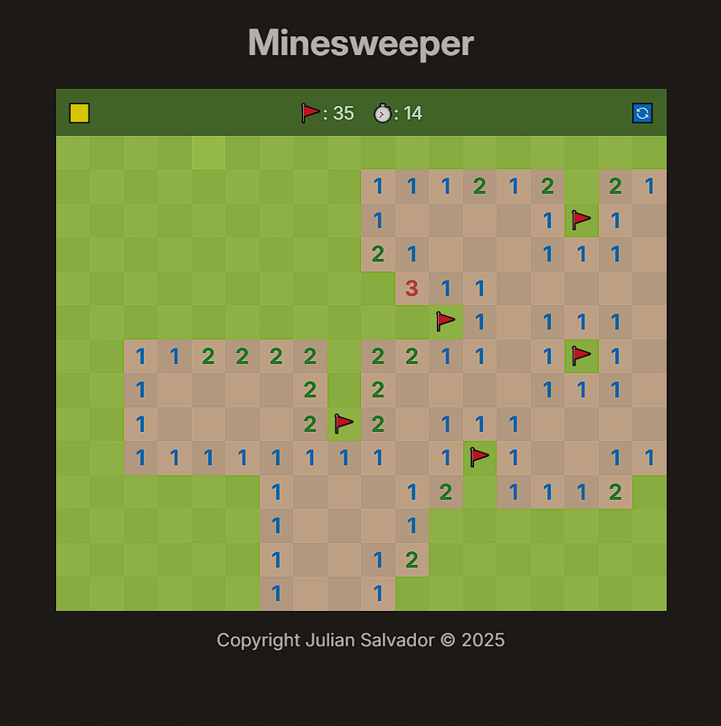

# 💣 Google Minesweeper Clone

A Minesweeper clone built with HTML, CSS, and JavaScript, built using Google's version as inspiration.

## 🔗 Live Demo

👉 [Try it here!](https://juliansalvador727.github.io/minesweeper/)

## 🚀 Features

- ✅ Medium difficulty level
- ✅ First-click is always safe
- ✅ Randomized mine placement
- ✅ Numbered tiles for adjacent mines
- ✅ Right-click to flag suspected mines (🚩)
- ✅ Win/loss detection
- ✅ Checkered hover effects
- ✅ Explosion animation

## 📌 To-Do

- [ ] Add reset button (rather than refresh page)
- [ ] Add mobile responsiveness and change page size for mobile devices
- [ ] Easy and Hard difficulty implementation
- [ ] Audio effects on click

## 🔧 Technologies Used

- HTML5
- CSS3 (with Flexbox)
- Vanilla JavaScript (no libraries or frameworks)

## 📸 Screenshot



## 🛠️ Setup Instructions

1. Clone the repository
2. Open `index.html` in your browser
3. Play!

   ```bash
   git clone https://github.com/yourusername/minesweeper.git
   cd minesweeper
   open index.html
   ```

## 📝 License

This project is open source and free to use under the [MIT License](LICENSE).
